# OnlineShop - sklep internetowy z męską modą

## Przygotowanie aplikacji do działania

### Instalacja i konfiguracja

#### Wymagania
- .NET 8 SDK
- Visual Studio 2022 lub VS Code
- SQL Server (np. SQL Server Management Studio) lub SQLite

#### Instalacja pakietów NuGet

Lista pakietów NuGet potrzebnych do uruchomienia aplikacji (należy wybrać kompatybilne wersje pakietów, w ramach projektu pakiety instalowano zgodnie z wersją 8.0.22):

- `Microsoft.EntityFrameworkCore` — rdzeń EF Core.
- `Microsoft.EntityFrameworkCore.SqlServer` — dostawca EF Core dla SQL Server (`Microsoft.EntityFrameworkCore.Sqlite` dla SQLite).
- `Microsoft.EntityFrameworkCore.Tools` — narzędzia EF Core (migracje).
- `Microsoft.AspNetCore.Identity.EntityFrameworkCore` — integracja Identity z EF Core.
- `Microsoft.AspNetCore.Identity.UI` — predefiniowane widoki i UI dla Identity.
- `Microsoft.AspNetCore.Mvc.Razor.RuntimeCompilation` — (opcjonalnie, przydatne w trybie deweloperskim do odświeżania Razor bez restartu).
- `Microsoft.VisualStudio.Web.CodeGeneration.Design` — (opcjonalnie, do scaffolding i generacji kodu).

### Klonowanie repozytorium
git clone https://github.com/natalia-kut/OnlineShop.git

cd OnlineShop

### Konfiguracja łańcucha połączenia z bazą danych
Aby skonfigurować połączenie z bazą danych należy zedytować plik `appsettings.json` i ustawić `ConnectionStrings:DefaultConnection`.

Przykład (LocalDB / SQL Server):
OnlineShop\appsettings.json
{
  "ConnectionStrings": {
    "DefaultConnection": "Server=(localdb)\\mssqllocaldb;Database=__OnlineShop__;Trusted_Connection=True;MultipleActiveResultSets=true"
  }
}

Przykład (SQLite):
OnlineShop\appsettings.json
{
  "ConnectionStrings": {
    "DefaultConnection": "Data Source=OnlineShop.db"
  }
}

### Migracje bazy danych w Visual Studio używając Package Manager Console
 W pierwszej kolejności należy włączyć konsolę menadżera pakietów:
 __Tools > NuGet Package Manager > Package Manager Console__
 A następnie w konsoli wywołać aktualizację: Update-Database

### Gotowe konta do obsługi aplikacji
Przygotowano dwa przykładowe konta testowe do obsługi aplikacji:
- Administrator: login: `admin_account@shop.pl` / hasło: `Admin123!`
- Zwykły użytkownik: login: `user@user.com` / hasło: `User123!`

### Uruchamianie w Visual Studio
1. Aby otworzyć projekt należy wybrać: __File > Open > Project/Solution__ i wybrać plik `.sln`.
2. Ustawić projekt `OnlineShop` jako projekt startowy (__Solution Explorer__ → Right-click → "Set as Startup Project").
3. Uruchomić: __Debug > Start Debugging__ lub __Debug > Start Without Debugging__.

## Opis działania i budowa aplikacji

### Diagram URL
Aplikacja oparta jest na 5 encjach + 1 dodatkowej encji użytkownika utworzonej za pomocą Identity. 
Utworzone encje to `Products`, `Orders`, `OrderItems`, `Carts`, `CartItems`, `AspNetUsers`.

Relacje przedstawiono na poniższym diagramie. Użytkownik (AspNetUsers) może posiadać wiele koszyków (Carts) oraz składać wiele zamówień (Orders). Każdy koszyk składa się z wielu pozycji (CartItems), które wskazują na konkretne produkty (Products) wraz z ilością i ceną jednostkową. Zamówienie zawiera pozycje (OrderItems), które również odnoszą się do produktów i przechowują ich ilość oraz cenę w momencie zakupu. Produkty mogą występować wielokrotnie zarówno w koszykach, jak i w zamówieniach.

Dodatkowo zaimplementowano model `ApplicationUser`, który rozszerza `IdentityUser` o np. FirstName, LastName.

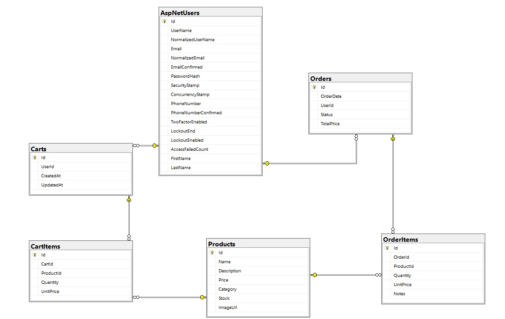

### Strona główna sklepu
Strona startowa aplikacji z możliwością szybkiego przejścia do wybranych kategorii lub panelu logowania.

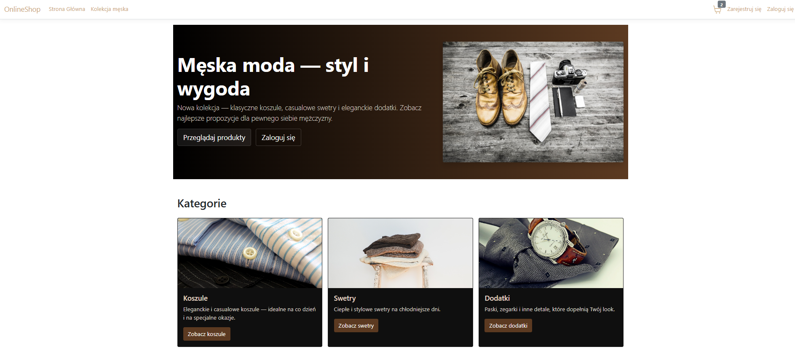

### Zakładka Kolekcja Męska
Lista dostępnych produktów, z możliwością filtrowania po kategoriach.

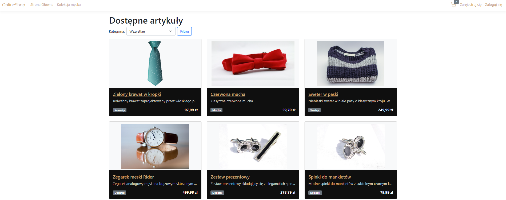
### Szczegóły produktu
Strona widoczna po kliknięciu w nazwę wybranego produktu. Widok strony zależy od roli użytkownika. Każdy użytkownik widzi zdjęcie, opis, cenę, stan magazynu oraz możliwość dodania do koszyka. Administrator widzi dodatkowe dwa przyciski `Edytuj` oraz `Usuń`, które przekierowują odpowiednio do podstrony umożliwiającej zmianę pól produktu lub jego usunięcie z oferty sklepu.

Widok z konta użytkownika:

Widok z konta administratora:
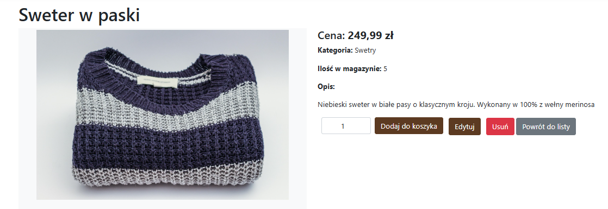

### Zarządzaj produktami: 
Dodatkowa zakładka w pasku nawigacyjnym widoczna tylko po zalogowaniu na konto administratora umożliwiająca przejście do dwóch podstron: `Dodaj nowy produkt` oraz `Edytuj/usuń produkty`, czyli listy wszystkich produktów z przyciskami do zarządzania produktami.

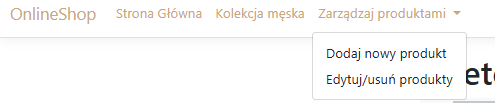

Dodawanie nowego produktu

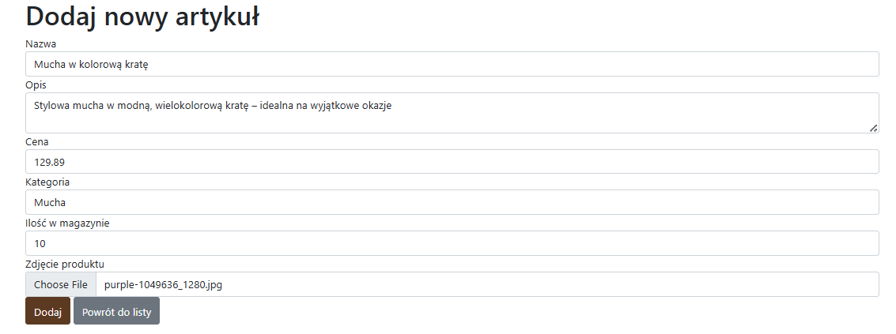

Zarządzanie dostępnymi produktami

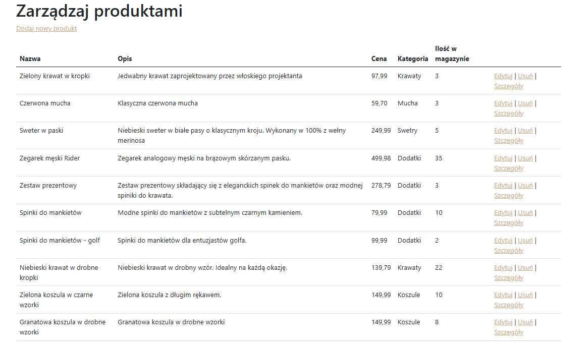

### Koszyk
Poprzez kliknięcie ikony koszyka w pasku nawigacyjnym użytkownik może przejść do listy produktów dodanych do koszyka w celu przeglądu pozycji, usunięcia produktów z koszyka lub złożenia zamówienia.

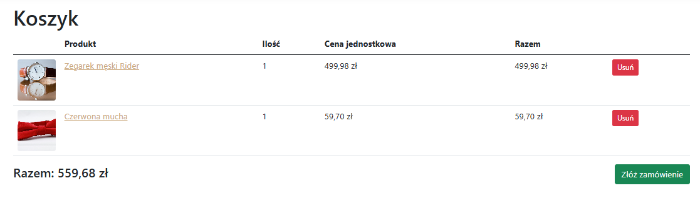

W aplikacji zaimplementowano uproszczony proces składania zamówień. Po kliknięciu przycisku `złóż zamówienie` użytkownik musi potwierdzić chęć złożenia zamówienia w banerze, po czym następuje przekierowanie do szczegółów zamówienia.

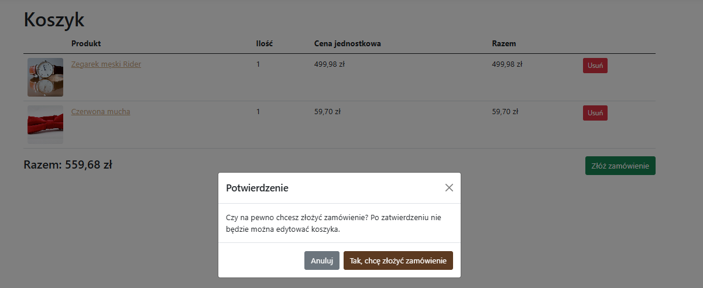

### Zarządzanie zamówieniami (po stronie administratora)
Administrator posiada uprawnienia do zarządzania wszystkimi zamówieniami, które wpłynęły od użytkowników sklepu. W celu przejścia do panelu zarządzania należy kliknąć na pasku nawigacyjnym w zakładkę 'Witaj Admin!', a następnie 'Zarządzaj zamówieniami'

Widok wszystkich zamówień

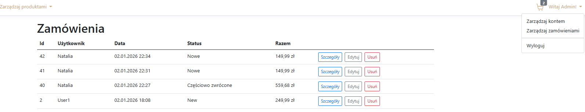

Podgląd szczegółów wybranego zamówienia

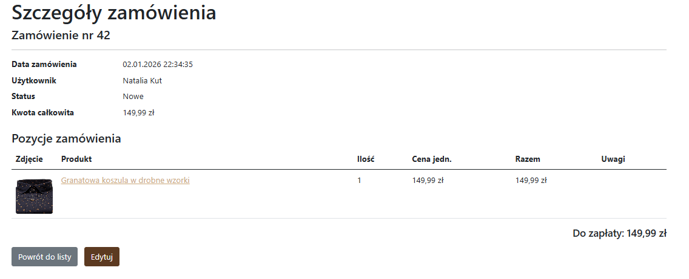

Edycja zamówienia po stronie administratora, np. po uwzględnieniu zwrotu lub wysłaniu produktu - możliwość zmiany statusu zamówienia, ilości zamówionych produktów, zmiany ceny jednostkowej, dopisania uwag.

Usuwanie zamówienia z bazy

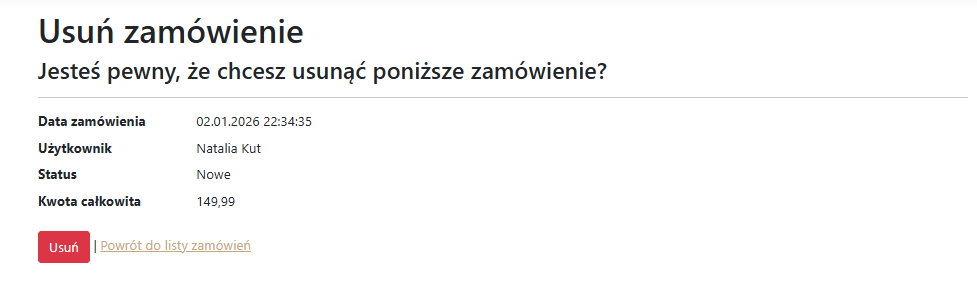

### Zarządzanie zamówieniami (po stronie użytkownika)

Użytkownik aplikacji zamiast zarządzania zamówieniami ma podgląd własnych złożonych zamówień z możliwością przejścia do szczegółów zamówienia.

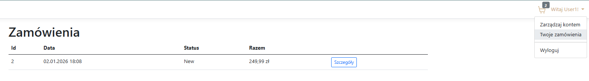

## TODO

Projekt stanowi solidny wstęp do rozbudowania i utworzenia w pełni funkcjonalnego sklepu internetowego. Poniżej proponowane rozszerzenia i priorytety prac:

1. Obsługa zwrotów i reklamacji (wysoki priorytet)
   - Workflow zwrotu: zgłoszenie, akceptacja, aktualizacja stanu magazynowego, refundacja/wymiana produktu.

2. Integracja płatności (średni priorytet)
   - Wdrożenie `IPaymentService` z integracją z np. PayPal
   - Obsługa statusów płatności.

3. Metody dostawy i koszty (średni priorytet)
   - Wybór dostawy przy finalizacji zamówienia, wyliczanie kosztów i terminów.

4. Warianty produktów — rozmiary/kolory (średni priorytet)
   - Wprowadzić model `ProductVariant` (rozmiar, kolor) w celu dokładniejszego rozróżniania produktów.

5. Panel administracyjny i raporty (niski/średni priorytet)
   - Widok zwrotów, historia zmian stanu magazynowego, filtrowanie i eksport zamówień.

6. Powiadomienia e‑mail (dodatkowo)
   - Potwierdzenia zamówień, zmiany statusu.